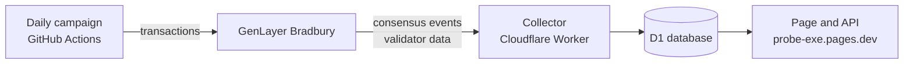

# Probe.EXE

[](https://github.com/randyparrs/Probe.EXE/actions/workflows/test.yml)

Probe.EXE measures how reliably Intelligent Contracts that call an LLM reach consensus on GenLayer's
Bradbury testnet, per operator and over time. It is a public network health page,
[probe-exe.pages.dev](https://probe-exe.pages.dev), with every number traceable to its source.



How the parts fit together and how each number gets to the page:
[docs/ARCHITECTURE.md](docs/ARCHITECTURE.md).

## Findings

Measured on Bradbury between September 28 and 30, 2026, over six windows of 50 transactions per
contract ([docs/VALIDATION-REPORT.md](docs/VALIDATION-REPORT.md),
`results/bradbury/network-report-v1.txt` to `v6.txt`).

- **With an LLM call the network diverges; without one it does not.** The control contract, which
  makes no LLM call, was accepted at the first attempt in 300 of 300 transactions, with no TIMEOUT
  or DETERMINISTIC_VIOLATION in its 1,500 votes. In the same windows the three contracts that call
  an LLM were accepted at the first attempt in 22% to 90% of their transactions: wizard 227 of 300,
  dvB 250 of 300, company 119 of 278.
- **What fails is the execution on the nodes, not the answer of the model.** Run locally, the
  committee accepted 300 of 300 passes; on the network the same contracts lost first attempts to
  validator timeouts, execution divergence and leader timeouts. The counts are measured; the
  conclusion is inferred from them.
- **Five operators voted TIMEOUT on every vote with an LLM call and on none without.** BlackNodes
  198 of 198, Blockscope 236 of 236, Brightlystake 215 of 215, StakingCabin 234 of 234, and Neturion
  Global 154 of 154 from the second window on. On the control they had no TIMEOUT or divergence in
  295 votes. The rest of the operators: 187 TIMEOUT in 4,655 votes with LLM (4.0%). This is data
  about what the chain recorded, not a judgment of how a node is run.
- **The prediction model did not pass its pre-registered criterion, by one pair.** Its predictions
  fell inside the measured 95% interval in 11 of 15 contract-window pairs; 12 were required. Its
  mean absolute error was 9.5 points against 10.0 for the naive prediction. The page shows no
  predictions.
- **Post-hoc sensitivity** ([docs/SENSITIVITY.md](docs/SENSITIVITY.md)): counting first attempts
  from consensus events instead of polling every second, 7 of 728 transactions are counted
  differently; 2 of them move one pair inside its interval and the criterion would be met (12 of 15,
  9.1 against 9.7). The pre-registered metric was polling, so the
  official result stands. Since 2026-10-01 the page counts from consensus events.

## What it does

- **Daily campaign** (`collector/campaign/`, `.github/workflows/campaign.yml`): once a day, at an hour
  that rotates across 8 slots, it sends calls to reference contracts (three that call an LLM and one
  control that does not, `collector/campaign/contracts.json`) and follows each transaction until it is
  accepted or ends without consensus. An external cron (cron-job.org) triggers the workflow; the
  campaign uses a testnet-only wallet.
- **Passive collector** (`collector/worker/`, `collector/core/`): a Cloudflare Worker that runs every
  minute, reads the consensus events of every transaction on the network and the validator lists of
  the staking contract, and keeps them in a D1 database. It only reads the chain.
- **Page** (`probe-static/`, `pages/`): static files plus one function that serves the read-only API
  of the collector from the page's own address. "How it works" on the page explains every number.
- **Daily data files** (`collector/export/`, `.github/workflows/export.yml`): every transaction the
  page has observed, in the `data` branch.

`npm test` runs the tests of the collector, the API, the page function and the export; a workflow
runs them on every push (`.github/workflows/test.yml`).

## Phases

The documents in `docs/` and the data in `results/` refer to two phases of measurements, before the
page existed:

- **Phase 0** (September 25 to 28, 2026): exploratory campaigns on Bradbury. They fixed how
  outcomes are counted ([docs/METRICS.md](docs/METRICS.md), versions 1 to 4).
- **Phase 1** (September 28 to 30, 2026): validation of the prediction model over six windows, with
  pre-registered predictions ([docs/VALIDATION-REPORT.md](docs/VALIDATION-REPORT.md),
  [docs/SENSITIVITY.md](docs/SENSITIVITY.md)).

The code of those measurements is in `scripts/` (campaign launcher, reports, prediction model,
evaluation), `harness/` and `tests/` (the local module) and `contracts/` (the measured contracts).
The epoch changes of that period are in [docs/EPOCHS.md](docs/EPOCHS.md).

## Data and pre-registration

`results/` holds the measurement data cited in `docs/`. The predictions of Phase 1 were
pre-registered, each one committed and pushed before its window ran, with the SHA-256 of the data
and code they used:
[github.com/randyparrs/probe-exe-preregistration](https://github.com/randyparrs/probe-exe-preregistration).

To check every hash of the pre-registration against this repository, clone both repositories side
by side and run, from the root of this one:

```bash
python scripts/verify_preregistration.py --prereg-dir ../probe-exe-preregistration
```

It reports 95 hashes that match exactly and 1 that matches a leading block of its file (explained in
the README of the pre-registration). The script fetches two originals that are not redistributed
here; `--offline` skips them.

**Pre-registered files are published unmodified**: every file whose SHA-256 is listed in the
pre-registration is published byte for byte, as it was when its hash was recorded. Some of them
cite internal working notes that are not part of this repository, by their file names in Spanish
(`FASE1-DISENO.md`, a design document, and `METRICAS.md`, whose public version is
[docs/METRICS.md](docs/METRICS.md)). Third-party files that cannot
be redistributed are obtained from their original at the exact commit, with their SHA-256
([contracts/SOURCES.md](contracts/SOURCES.md)).

There is one exception: `harness/contracts.py`. The pre-registered file carried four lines
taken from a repository with no license, so it is published with those lines replaced by markers.
`python harness/restore_contracts.py` downloads the original at the exact commit, puts the lines
back and checks that the result has the pre-registered SHA-256.

The reports in `results/bradbury/` can be produced again from the published data:
`scripts/network_report.py` (`network-report-v1.txt` to `v6.txt`), `scripts/evaluate_validation.py`
(`validation-final.txt`) and `scripts/sensitivity_events.py` (`sensitivity-events.txt`). The two
annexes, `annex-phase0-v5.txt` and `annex-reread-v4.txt`, are the output of one-off analyses over
the first Phase 0 campaigns, whose rows are not published here; they cannot be produced again from
this repository.

Two things in `results/` are in Spanish and are published as they were recorded:

- Run tags starting with `prueba` (Spanish for "test") mark test runs. They are kept in the raw
  data unmodified and are not used in any of the published analyses.
- `results/bradbury/validation-final.txt` is the literal output of the frozen evaluation script,
  which labels the metric version as METRICAS v5 (Spanish). It is published unmodified.

## Data files

The [`data` branch](https://github.com/randyparrs/Probe.EXE/tree/data) holds every transaction the
page has observed, one pair of files per epoch: `epoch-N.csv` and `epoch-N.jsonl`, listed in
`index.json` (`{ updated, files: [{ epoch, csv, jsonl, rows }] }`). A workflow writes them once a day
(`.github/workflows/export.yml`, `collector/export/export.mjs`) from the public API of the page:
`GET /api/export?epoch=N` returns 200 transactions per page and a `next` value to pass as `&after=`
for the following page. The epoch in progress is rewritten every day. A closed epoch is rewritten
only when its rows changed (a transaction that ended after the epoch closed), and the commit message
says what changed.

One row per transaction, in creation order. Times are Unix seconds (UTC).

| Column | Meaning |
|---|---|
| `tx_id` | Transaction id on GenLayer. |
| `epoch` | Epoch in effect when the transaction was created. |
| `contract` | Address of the contract the transaction calls. |
| `llm` | `llm`: the contract code contains an LLM call (`exec_prompt`, `prompt_comparative` or `prompt_non_comparative`). `none`: it does not. `na`: the code could not be read. Empty: not read yet. |
| `campaign` | Name of the reference contract when the transaction was sent by the campaign wallet to one of its copies. Empty for every other transaction. |
| `created` | Time of the block that created the transaction. |
| `created_block` | Number of that block. |
| `status` | `first`: accepted at the first attempt. `retry`: accepted after a retry. `none`: ended without consensus (validators timeout, undetermined, cancelled, or an acceptance overturned by an appeal). `pending`: no decision yet. `unknown`: a round ended and its result was not observed. |
| `accepted` | Time of the first real acceptance. Empty when there was none. |
| `accept_seconds` | `accepted` minus `created`. |
| `leader_timeouts` | Leader timeouts before the first acceptance. |
| `rotations` | Leader rotations before the first acceptance. |
| `appeals` | Appeals started before the first acceptance. |
| `recomputations` | Times the transaction was sent back to be executed again, before the first acceptance. |
| `votes_agree` | Votes revealed as AGREE, over all its attempts. |
| `votes_disagree` | Votes revealed as DISAGREE. |
| `votes_dv` | Votes revealed as DETERMINISTIC_VIOLATION (execution divergence). |
| `votes_timeout` | Votes revealed as TIMEOUT. |

The JSON Lines file has the same fields and one more, `attempts`: the list of attempts of the
transaction, each with its `leader`, whether the leader timed out (`leader_timeout`), the `result`
of the round (`agree`, `disagree`, `timeout`, `dv`, `no_majority`, `majority_agree`,
`majority_disagree`, `idle`, or null when the round did not end) and its `votes` as pairs of
validator address and vote (`agree`, `disagree`, `timeout`, `dv`, `not_voted`).

The counting rules are in [docs/METRICS.md](docs/METRICS.md). Transactions that started before the
page began observing (2026-10-01) are not exported.

## API

The page serves a read-only JSON API from its own address. It needs no key and can be called from
any origin. It returns counts and rates; the intervals shown on the page are computed from the
counts (Clopper-Pearson, `probe-static/stats.js`).

| Endpoint | Returns |
|---|---|
| `GET /api/meta` | Last update per source, current epoch, list of epochs, RPC state. |
| `GET /api/tape` | The last 40 network transactions with their result. |
| `GET /api/overview?view=` | First-attempt acceptance of the campaign (with LLM and control) and of the network, votes by type, retry causes, time to acceptance, validator counts, last campaign. |
| `GET /api/contracts?view=` | Reference contracts, every contract of the network with its LLM label, and stalled contracts. |
| `GET /api/operators?view=` | One row per validator: votes by type on campaign contracts with LLM, on the control and on the whole network, leader rounds and leader timeouts, status, stake, selection weight, first-leader counts against the expected ones, and a series by epoch. |
| `GET /api/events?view=&type=&before=` | The event log, 50 per page. `type`: `epochs`, `validators`, `contracts`, `campaigns` or `rpc`. `before`: the `next` value of the previous page. |
| `GET /api/status` | The last block the collector stored and its last ten runs (range read, requests to the RPC, errors). |
| `GET /api/badge/{contract}.svg` | An SVG badge with the first-attempt acceptance of a contract in the current epoch, colored like the health labels of the page. |
| `GET /api/export?epoch=&after=` | Every transaction of an epoch with its attempts and votes, 200 per page. `after`: the `next` value of the previous page. Columns: see Data files. |

`view` is `epoch:168` (one epoch) or `24h` (the last 24 hours); without it the answer is for the
current epoch.

```bash
curl "https://probe-exe.pages.dev/api/operators?view=epoch:168"
```

A badge can be embedded in any README or page; the Contracts section of the page has a `[badge]`
button on each contract that copies this Markdown:

```markdown
[](https://probe-exe.pages.dev/#f2)
```

Responses are cached: 60 seconds for `/api/meta`, `/api/tape` and `/api/status`, 300 seconds for the
rest. Requests answered from the cache are not limited. Requests that are not in the cache are
limited to 120 per minute from one address; over the limit the API answers 429 with a `Retry-After`
header. For bulk use, take the daily data files instead.

## Limits

- Bradbury is a testnet. Validator software and contracts can change without notice.
- The campaign covers four fixed contracts. It does not represent every contract.
- One campaign a day gives about 80 transactions per contract, so intervals are wide.
- There are no alerts in this version.
- The latency of transactions that cross an epoch change is not reported yet.
- Transactions accepted with an execution error are not counted apart: consensus events do not
  carry the execution result, so they count as accepted.
- Network counts depend on the RPC. Gaps in RPC data are listed in Events.
- Operator names are declared by the operators on chain and are not verified.

The read-only API is meant to let others build alerts.

## Sources

- GenLayer documentation: [docs.genlayer.com](https://docs.genlayer.com);
  [staking and selection weight](https://docs.genlayer.com/understand-genlayer-protocol/core-concepts/optimistic-democracy/staking);
  [slashing, bans and quarantine](https://docs.genlayer.com/understand-genlayer-protocol/core-concepts/optimistic-democracy/slashing);
  [staking methods of genlayer-js](https://docs.genlayer.com/api-references/genlayer-js/staking).
- Bradbury explorer: [explorer-bradbury.genlayer.com](https://explorer-bradbury.genlayer.com).
- Contract addresses and event definitions:
  [genlayer-js](https://github.com/genlayerlabs/genlayer-js) 1.2.0. Origin of the measured contracts:
  [contracts/SOURCES.md](contracts/SOURCES.md).
- Clopper-Pearson interval: C. J. Clopper and E. S. Pearson, "The use of confidence or fiducial
  limits illustrated in the case of the binomial", Biometrika 26 (1934);
  [summary](https://en.wikipedia.org/wiki/Binomial_proportion_confidence_interval).
- Cloudflare: [Workers](https://developers.cloudflare.com/workers/),
  [D1](https://developers.cloudflare.com/d1/),
  [Pages Functions](https://developers.cloudflare.com/pages/functions/),
  [Cache API](https://developers.cloudflare.com/workers/runtime-apis/cache/),
  [rate limiting binding](https://developers.cloudflare.com/workers/runtime-apis/bindings/rate-limit/).
- GitHub: [Actions](https://docs.github.com/en/actions),
  [workflow dispatch API](https://docs.github.com/en/rest/actions/workflows#create-a-workflow-dispatch-event).
  External cron: [cron-job.org](https://cron-job.org).

## Author

Randy Parra, [github.com/randyparrs](https://github.com/randyparrs).

## License

MIT ([LICENSE](LICENSE)). The measured contracts and the third-party files have their own terms:
[contracts/SOURCES.md](contracts/SOURCES.md). The fonts of the page, JetBrains Mono and VT323, are
under the SIL Open Font License 1.1 (`probe-static/assets/fonts/OFL-JetBrainsMono.txt`,
`probe-static/assets/fonts/OFL-VT323.txt`).
