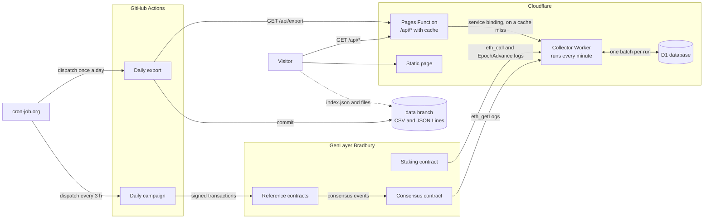
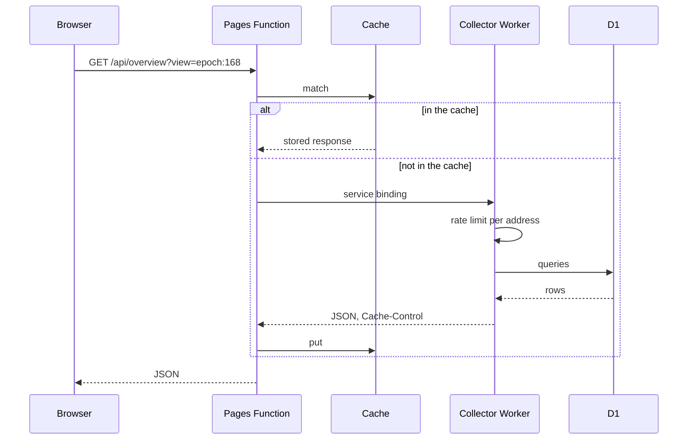

# Architecture

Probe.EXE has five parts: a daily campaign that sends transactions, a collector that reads the chain,
a database, a page with a read-only API, and a daily export of the data. Everything is read from
GenLayer's Bradbury testnet; only the campaign writes to it.

## Components

| Component | Where | What it does |
|---|---|---|
| Daily campaign | `collector/campaign/`, `.github/workflows/campaign.yml` | Sends 80 calls to each of four reference contracts (three that call an LLM, one control that does not) in one window a day. |
| Collector | `collector/worker/`, `collector/core/` | A Cloudflare Worker on a Cron Trigger. Every minute it reads the new consensus events and the validator data, and updates the database. It also answers the API. |
| Database | Cloudflare D1, `collector/worker/schema.sql` | Raw events, the state of each transaction, hourly counters, validators, eligible sets, the event log. |
| Pages Function | `pages/functions/api/[[path]].js` | Serves `/api/*` from the page's address: answers from the cache or forwards to the collector. |
| Page | `probe-static/` | Static HTML, CSS and JavaScript. It reads the API and computes the intervals. |
| Daily export | `collector/export/`, `.github/workflows/export.yml` | Writes one CSV and one JSON Lines file per epoch to the `data` branch. |

## Triggers

GitHub's own schedule can run late or skip runs, so both workflows are started by an external cron
(cron-job.org) through the `workflow_dispatch` API.

- **Campaign**: dispatched every 3 hours. Each dispatch checks whether it is the slot of the day
  (`collector/campaign/slot.mjs`, day of the year modulo 8) and exits in seconds when it is not, so
  the campaign visits eight different hours over eight days.
- **Export**: dispatched once a day.
- **Collector**: a Cloudflare Cron Trigger, every minute.

## How each number gets to the page

The page labels every block with its source.

### [NET] Every transaction on the network

1. A run of the collector asks the RPC for the logs of the consensus contract since the last block
   it stored (`eth_getLogs`, up to 250 blocks per run, so a backlog catches up by itself).
2. `collector/core/events.js` decodes each log and applies it, in chain order, to the state of its
   transaction: attempts, leader of each attempt, votes, timeouts, rotations, appeals. The state
   gives the class of the transaction: accepted at the first attempt, accepted after a retry, no
   consensus, or pending. The rule is in [METRICS.md](METRICS.md).
3. The run adds the transaction to the hourly counters of its contract (`contract_hour`) and each
   vote and leader round to the hourly counters of its validator (`op_hour`). When a transaction
   changes class later, the counters move it from the old class to the new one.
4. The code of each new contract is read once (`gen_getContractCode`) to label it as calling an LLM
   or not.
5. Everything a run produced is saved in one database batch together with the new cursor. The batch
   fails if another run moved the cursor first, so a range is never counted twice.

### [CAMP] The daily campaign

The campaign workflow only sends transactions; it does not write to the database. The collector
recognizes a campaign transaction among the network ones: its recipient is a copy of a reference
contract (`collector/campaign/contracts.json`) and its sender is the campaign wallet (read with
`eth_getTransactionByHash`). Those transactions are counted a second time under the campaign
source, split between contracts with LLM calls and the control. A day whose slot passes with no
campaign transaction is shown as a failed campaign.

### [CHAIN] Validators and epochs

- **Epochs**: the `EpochAdvance` logs of the staking contract, read with the consensus logs.
- **Validator lists**: the active list, the banned list and the quarantine records (`eth_call` at
  the last block of the range), every five minutes and whenever an epoch starts. A validator is
  eligible when it is active, not banned and with no quarantine in effect.
- **Stake and declared name**: a few validators per run, the ones read longest ago.
- **Eligible set**: stored each time its validators change and at each epoch change
  (`eligible_set`). When the first leader of a campaign transaction is activated, the collector
  adds one to that validator and, to every validator of the set in effect at that block, its share
  of the total selection weight (`leader_draw`). The committee selection check compares the two.

### Events

Epoch changes, campaigns and RPC incidents are derived when the API is asked, from the stored
epochs, campaign transactions and collector runs. Changes of the eligible set, quarantines, bans
and stalled or recovered contracts are written to a log by the collector when it detects them.

## The request path

- The collector has no public address: the only way in is the service binding of the page.
- The Worker sets how long a response may be kept: 60 seconds for the tape and the current state,
  300 seconds for the aggregates. The cache key keeps only the query parameters the API reads.
- Requests that miss the cache are limited to 120 per minute from one address.
- The API returns counts and rates. The page computes the 95% Clopper-Pearson intervals and the
  chi-square test in the browser (`probe-static/stats.js`), so they can be reproduced from the
  counts.

## The database

| Table | Content |
|---|---|
| `events` | Raw consensus events as decoded from the logs. |
| `tx` | One row per transaction: its state built from the events, its class, epoch, campaign mark. |
| `contract_hour` | Hourly counters per contract: transactions by class and votes by type. |
| `op_hour` | Hourly counters per validator and source: votes by type, leader rounds, leader timeouts. |
| `contracts` | Every contract that received a transaction, with its LLM label. |
| `contract_stall` | Stalled contracts: transactions in a row without a vote, last stall and recovery of each contract. |
| `epochs` | Start block and time of each epoch. |
| `validators` | Lists each validator is in, stake, declared name. |
| `eligible_set` | The eligible validators and their weights, from the block each set is in effect. |
| `leader_draw` | First leaders of campaign transactions per validator: observed and expected. |
| `log` | Changes of the eligible set, quarantines, bans, stalled and recovered contracts. |
| `runs` | One row per run of the collector: range read, RPC requests, errors. |
| `meta` | Cursor (last block stored), current epoch, time of the last list read. |

A view of the page is either one epoch or the last 24 hours. Both are sums over the hourly counters,
so an answer never has to read the state of each transaction.

## The daily export

`collector/export/export.mjs` asks the page for its list of epochs and reads every page of
`GET /api/export` for each one. It writes `epoch-N.csv`, `epoch-N.jsonl` and `index.json`, and the
workflow commits them to the `data` branch. A file is rewritten only when its content changed: the
epoch in progress every day, a closed epoch only when a transaction ended after it closed, and then
the commit message says what changed. The columns are in the [README](../README.md#data-files).

## Limits that shaped the design

The collector and the page run on Cloudflare's free plan.

- A run of the collector has about 10 ms of CPU and 50 requests to the RPC and the database. This
  is why the aggregates are built incrementally by the collector and not computed when asked.
- The database allows 100,000 rows written a day. A run writes a fixed number of statements
  whatever the number of events: lists travel as one JSON parameter.
- The RPC limits `eth_getTransactionByHash`, so a run reads at most 10 senders and stops its range
  before the next one.
- Requests to the API count against a daily quota, with or without the cache. The cache saves
  database reads, and the rate limit protects them from requests that vary the address to miss it.

## Secrets

There are two secrets, and neither is in this repository:

- The key of the campaign wallet, a testnet-only wallet, stored as a GitHub Actions secret
  (`CAMPAIGN_PRIVATE_KEY`). Only the campaign workflow reads it.
- A GitHub token stored in cron-job.org, with permission to dispatch the workflows of this
  repository. The external cron sends it in the header of its two requests.

The collector and the export only read public data and need no credential.

## Tests

`npm test` runs the decoder and the transaction state on recorded logs, the collector and its SQL on
an in-memory database with a fake RPC, the API answers, the Pages Function with a fake cache and the
export against a fake page.
